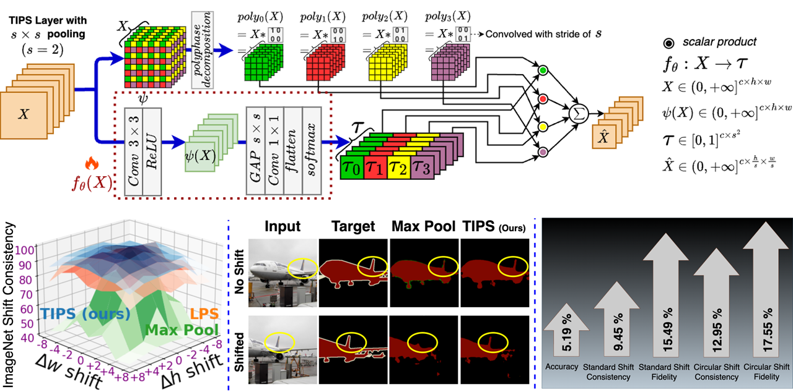

# TIPS: Translation Invariant Polyphase Sampling
Official implementation of "Improving Shift Invariance in Convolutional Neural Networks with Translation Invariant Polyphase Sampling"

_TIPS: Translation Invariant Polyphase Sampling is a learnable pooling operator that provide robustness against shift perturbation of images._




## Installation
Please install the following libraries:
1. pytorch 
2. PIL
3. torchvision
4. numpy

- To train and evaluate at one go, run the following command:

- Goto the directory in terminal where the code base (unzipped) is to train with TIPS
```
python3 train_test.py --MODEL_PATH "/...directory to save & load your model weights../" --tips --model_name 'resnet50' --epochs 480 --batch_size 64 --dataset 'tiny-imagenet' --data_path "/...directory containing dataset../" --num_down 5 --num_classes 200 --device 'cuda:0' --wake_up_at 100
```

### to train with APS
```
python3 train_test.py --MODEL_PATH "/...directory to save & load your model weights../" --aps --model_name 'resnet50' --epochs 480 --batch_size 64 --dataset 'tiny-imagenet' --data_path "/...directory containing dataset../" --num_down 5 --num_classes 200 --device 'cuda:0'
```

### to train with avgpool
```
python3 train_test.py --MODEL_PATH "/...directory to save & load your model weights../" --avgpool --model_name 'resnet50' --epochs 480 --batch_size 64 --dataset 'tiny-imagenet' --data_path "/...directory containing dataset../" --num_down 5 --num_classes 200 --device 'cuda:0' 
```

### to train with maxpool
```
python3 train_test.py --MODEL_PATH "/...directory to save & load your model weights../" --maxpool --model_name 'resnet50' --epochs 480 --batch_size 64 --dataset 'tiny-imagenet' --data_path "/...directory containing dataset../" --num_down 5 --num_classes 200 --device 'cuda:0' 
```

### to train with blurpool
```
python3 train_test.py --MODEL_PATH "/...directory to save & load your model weights../" --blurpool --model_name 'resnet50' --epochs 480 --batch_size 64 --dataset 'tiny-imagenet' --data_path "/...directory containing dataset../" --num_down 5 --num_classes 200 --device 'cuda:0' 
```

# Contributing

Pull requests are welcome. For major changes, please open an issue first to discuss what you would like to change.

Please make sure to update tests as appropriate.

# License

[MIT](https://choosealicense.com/licenses/mit/)
